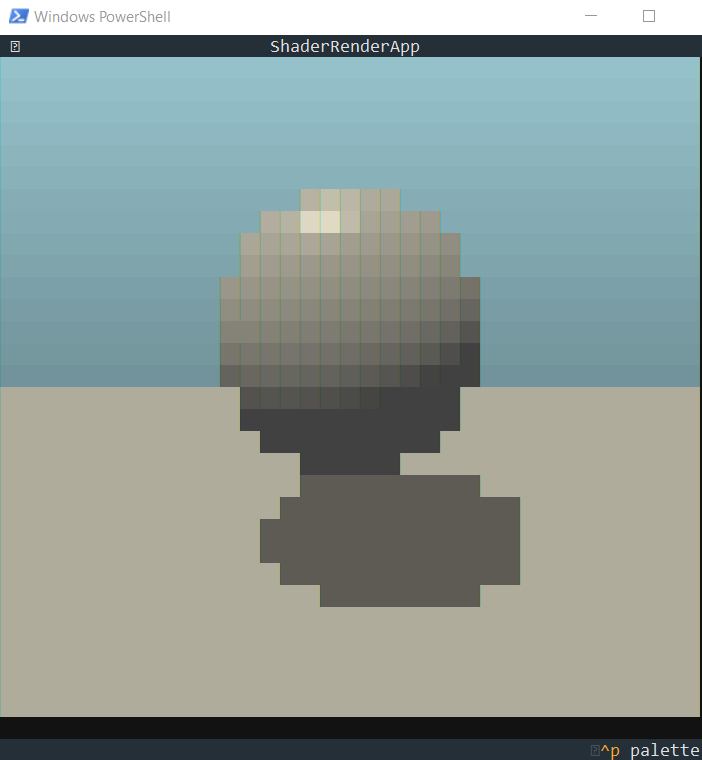

# Textual Shader Renderer

This project demonstrates how to render GLSL fragment shaders in a terminal using ModernGL for headless rendering and Textual for the user interface. It effectively plays shader animations as colored block-art directly in your console.

## Core Components

The project is split into two main Python files:

### 1. `src/morderngl_load.py` - The Headless Renderer

This script is the backend for all the OpenGL operations.

- **Technology**: It uses `moderngl` to create a **headless (off-screen) OpenGL context**. This means it can perform rendering without needing to open a visible window, making it perfect for backend tasks.
- **`OffScreenRenderer` Class**: This class encapsulates the entire rendering setup.
    - It initializes the ModernGL context, loads and compiles GLSL vertex and fragment shaders from provided file paths.
    - It sets up the necessary geometry (a simple full-screen quad) and a Framebuffer Object (FBO) to render onto.
    - The core method, `render_frame(current_time)`, takes the current animation time as input, executes the shader pipeline, and returns the resulting image as a raw `numpy` array of pixel data.
- **Execution**: When run as a standalone script, it renders a single frame and saves it as `rendered_sdf_output.png` to demonstrate its functionality.

### 2. `src/app.py` - The Textual Display App

This script is the user-facing application that displays the output from the renderer.

- **Technology**: It is a Terminal User Interface (TUI) application built with the `textual` framework.
- **`ShaderRenderApp` Class**: This class orchestrates the rendering and display loop.
    - On startup (`on_mount`), it creates an instance of the `OffScreenRenderer`.
    - It runs a timer that calls `update_frame` at a regular interval to achieve the target Frames Per Second (FPS).
- **The Rendering Pipeline**:
    1. In `update_frame`, it calls `renderer.render_frame()` to get the latest animation frame as a `numpy` array.
    2. The raw pixel data is converted into a `Pillow` (PIL) Image.
    3. A helper function, `_convert_image_to_text`, processes the image and builds a string of styled characters. It iterates through the image two rows at a time. For each column, it takes two vertical pixels and uses a half-height block character (`▄`) to represent them. The color of the top pixel is set as the character's background color, and the bottom pixel's color is set as the foreground color. This is done using Textual's rich markup, like `[rgb(0,255,0) on rgb(255,0,0)]▄[/]`. This technique doubles the effective vertical resolution of the display.
    4. The resulting string is used to update a `Static` widget on the screen, effectively drawing the rendered frame in the terminal.
    5. This process repeats, creating a live video effect.

## How it Works: A Summary

1.  `app.py` starts the Textual application.
2.  It initializes the `OffScreenRenderer` from `morderngl_load.py`.
3.  On a fixed timer (e.g., 20 times per second):
    - `app.py` asks the renderer for a new frame, passing in the current time (`iTime`).
    - `morderngl_load.py` uses OpenGL to run the fragment shader and renders the output to an off-screen texture.
    - The texture's pixel data is read and returned to `app.py` as a NumPy array.
    - `app.py` converts this array into a string of styled half-height block characters, using two pixels of the image for each character in the terminal to double the vertical resolution.
    - The Textual `Static` widget is updated, "drawing" the frame in the terminal.

## Screenshot



## Shaders

- The GLSL shaders are located in `src/shaders/`.
- `dummy.vert`: A minimal vertex shader that simply passes through the geometry for the full-screen quad. The main logic is in the fragment shader.
- `rayMarching.frag`: The fragment shader where the visual magic happens. It receives two important uniforms:
    - `uniform vec2 iResolution`: The width and height of the rendering canvas.
    - `uniform float iTime`: The elapsed time since the application started, used for creating animations.

## How to Run

To run the terminal application, execute `app.py`:

```bash
python src/app.py
```

## Dependencies

You need to have the following Python libraries installed:

- `textual`
- `moderngl`
- `numpy`
- `Pillow`
- `scipy`
